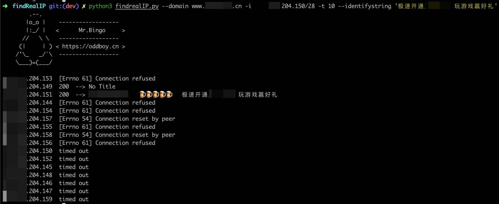

关于CDN下查找真实IP的办法，网上一堆文章，但是实际情况是，替代hosts进行尝试并不是一个现实可行的办法，故而这种小工具就由我来写写，望大佬们指教。

# 尽可能完全获取候选IP
  - 找所有旁站(包括@域)IP，从而确定C段。

  - 历史IP记录   `https://toolbar.netcraft.com/site_report?url=www.xxx.com`

  - 全球多地多DNS解析，获取可能的IP。

  - 通过SPF记录，确定IP，若无SPF，可查看邮件头中的IP地址。

# 使用脚本验证
```
✗ python3 findrealIP.py -h
        .--.
       |o_o |    ------------------
       |:_/ |   <      Mr.Bingo     >
      //   \ \   ------------------
     (|     | ) < https://oddboy.cn >
    /'\_   _/`\  ------------------
    \___)=(___/

usage: findrealIP.py [-h] [--protocol PROTOCOL] --domain DOMAIN [--port PORT]
                     [--path PATH] (-i IP | -I IPS) [-t THREAD]
                     [--identifystring IDENTIFYSTRING]

optional arguments:
  -h, --help            show this help message and exit
  --protocol PROTOCOL   HTTP or HTTPS, default: HTTP
  --domain DOMAIN       Target Domain, eg: www.oddboy.cn
  --port PORT           Service Port, eg: 80
  --path PATH           Target Path, eg: / or /WebRoot, default: /
  -i IP                 Signal IP, eg: 8.8.8.8 or 8.8.8.8/24
  -I IPS                IP list file
  -t THREAD             Thread Count, default: 1
  --identifystring IDENTIFYSTRING
                        Use Identify String to Ident The True Target
```
示例如下：


